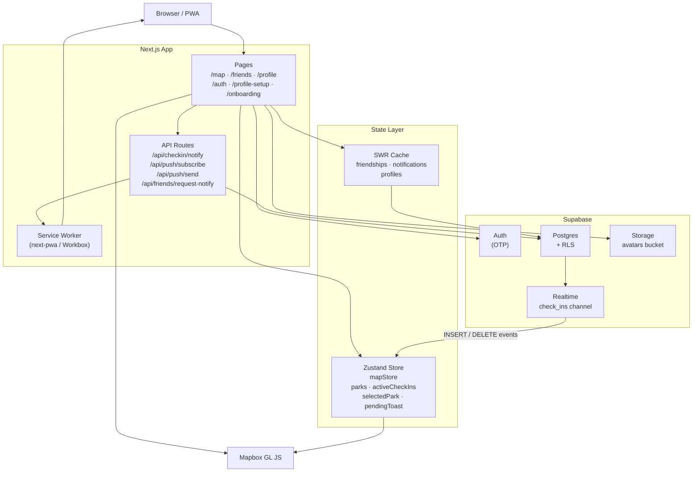
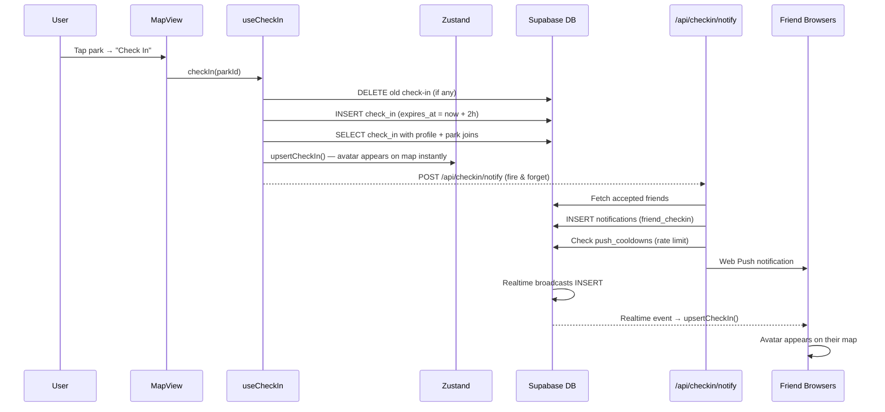
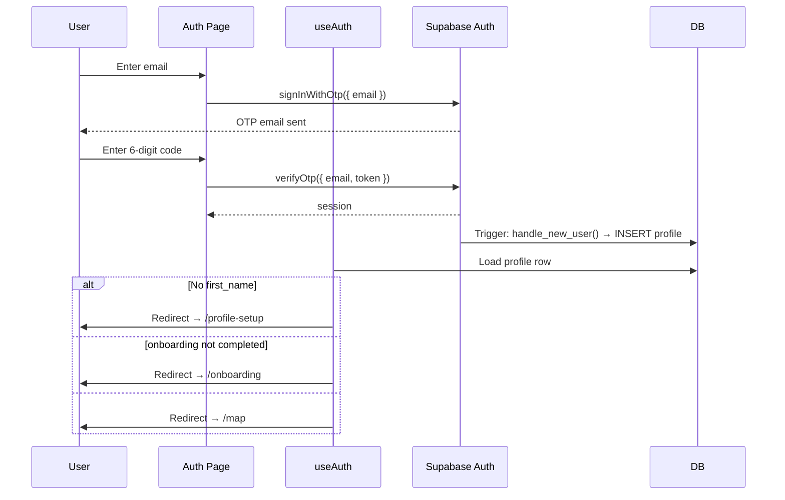
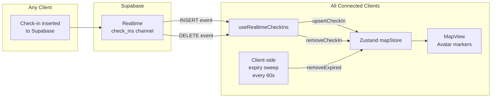
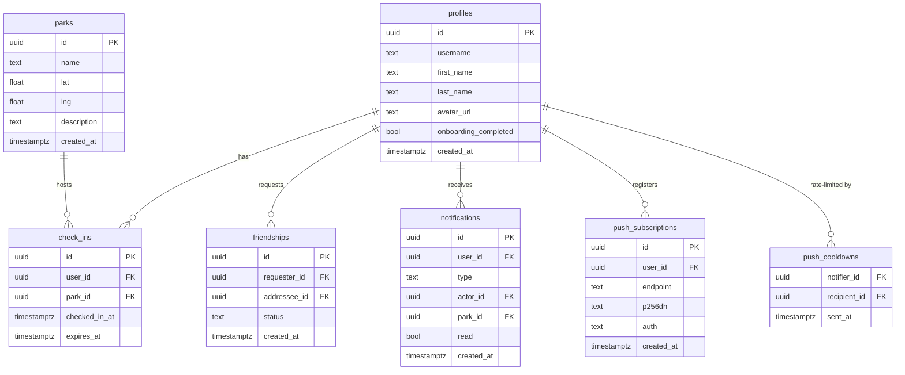
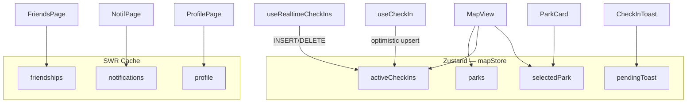

# NeedOne

A mobile-first Progressive Web App for a pickleball community. The core concept is a **map-first social app** where the hero feature is real-time profile picture avatars on a Mapbox map showing who is currently checked in at each park — think Bump/Zenly for pickleball.

---

## Features

- **Real-time map** — Avatar heads appear on a Mapbox GL map when friends check in
- **Check-in system** — One-tap to check in at a park; check-in expires after 2 hours
- **Friend discovery** — Search users, send/accept friend requests
- **Push notifications** — Browser Web Push when friends check in or respond to requests
- **In-app notification feed** — Friend requests, accepted requests, check-in alerts
- **Profile management** — Name, avatar upload, username auto-generated
- **PWA installable** — Add to Home Screen on iOS/Android

---

## Tech Stack

| Category | Technology |
|---|---|
| Framework | Next.js 14, Pages Router |
| Styling | Tailwind CSS |
| Map | Mapbox GL JS via `react-map-gl` v7 |
| Backend | Supabase (Postgres, Auth, Realtime, Storage) |
| Auth | Supabase Auth — OTP via email |
| State | Zustand (map markers, active check-ins) |
| Data Fetching | SWR (friend lists, profiles, notifications) |
| Date/Time | date-fns |
| Icons | Lucide React |
| Push Notifications | Web Push API + Service Worker |
| PWA | next-pwa (Workbox) |
| Email | Resend |

---

## Architecture Overview



---

## Data Flow: Check-in

When a user taps a park and checks in, several things happen in parallel.



---

## Data Flow: Authentication



---

## Real-time Map Updates



---

## Database Schema



---

## Project Structure

```
needonev2/
├── pages/
│   ├── index.tsx              # Landing page (public, SEO, install CTA)
│   ├── auth.tsx               # OTP sign-in
│   ├── profile-setup.tsx      # First-time name + avatar
│   ├── onboarding.tsx         # Discover friends post-signup
│   ├── map.tsx                # Alias → /
│   ├── friends.tsx            # Friend list, requests, discovery
│   ├── notifications.tsx      # In-app notification feed
│   ├── profile.tsx            # User settings + permissions
│   └── api/
│       ├── checkin/notify.ts          # Fan out check-in notifications
│       ├── push/subscribe.ts          # Save browser push subscription
│       ├── push/send.ts               # Send Web Push (internal)
│       └── friends/request-notify.ts  # Notify on friend request
│
├── components/
│   ├── Map/
│   │   ├── MapView.tsx        # Interactive Mapbox GL map
│   │   ├── AvatarHead.tsx     # Avatar marker (custom Mapbox overlay)
│   │   ├── ParkPin.tsx        # Park location pin
│   │   ├── ParkCard.tsx       # Park bottom sheet (check-in button)
│   │   └── UserBottomSheet.tsx # Tapped user profile card
│   ├── BottomNav.tsx          # 3-tab nav: Map · Friends · Profile
│   ├── BottomSheet.tsx        # Reusable bottom sheet
│   ├── InitialsAvatar.tsx     # Color-coded fallback avatar
│   └── NotificationBell.tsx   # Unread badge on Profile tab
│
├── hooks/
│   ├── useAuth.tsx            # Auth context + profile loading + redirects
│   ├── useCheckIn.ts          # Check-in / check-out logic
│   ├── useRealtimeCheckIns.ts # Supabase Realtime → Zustand
│   ├── useFriendships.ts      # SWR + Realtime for friend graph
│   ├── useDiscoverPeople.ts   # Search unconnected profiles
│   └── useNotifications.ts    # Notification feed + mark-read
│
├── store/
│   └── mapStore.ts            # Zustand: parks, activeCheckIns, selectedPark
│
├── lib/
│   ├── supabase.ts            # Browser Supabase client (anon key)
│   ├── supabaseServer.ts      # Server-only client (service role)
│   └── types.ts               # Shared TypeScript interfaces
│
├── constants/
│   └── parks.ts               # Default camera position only (parks from DB)
│
├── supabase/migrations/       # Ordered SQL migrations
└── public/
    ├── sw.js                  # Service worker (Workbox, built by next-pwa)
    └── manifest.json          # PWA manifest
```

---

## State Management

Zustand is used for the live map state that needs to update instantly across components. SWR handles everything else.



---

## API Route Security

Every API route enforces the following:

| Check | Mechanism |
|---|---|
| Authentication | Bearer JWT via `supabaseServer.auth.getUser(token)` |
| Internal routes | `x-service-key` header match |
| UUID validation | Regex `/^[0-9a-f]{8}-...-[0-9a-f]{12}$/i` on all ID params |
| URL validation | Relative paths only — `startsWith('/')` && `!startsWith('//')` |
| String length | `title` ≤ 100 chars, `body` ≤ 200 chars for push payloads |
| Method guard | 405 returned for unexpected HTTP methods |
| Rate limiting | `push_cooldowns` table — 1 min cooldown per notifier→recipient pair |

---

## Getting Started

### Prerequisites

- Node.js 18+
- Docker (for local Supabase)
- Mapbox account ([access token](https://account.mapbox.com/access-tokens/))

### Setup

```bash
# Install dependencies
npm install

# Copy env template
cp .env.local.example .env.local
# Fill in NEXT_PUBLIC_SUPABASE_URL, NEXT_PUBLIC_SUPABASE_ANON_KEY,
# SUPABASE_SERVICE_ROLE_KEY, NEXT_PUBLIC_MAPBOX_TOKEN

# Start local Supabase (requires Docker)
npx supabase start

# Copy the printed anon key + service role key into .env.local

# Apply migrations (creates tables, RLS, seed parks)
npx supabase db reset

# Start dev server
npm run dev
```

App runs at `http://localhost:3000`. Local emails (OTP codes) are captured by Inbucket at `http://localhost:54324`.

### Optional: Cloudflare Tunnel (HTTPS / OAuth / Push)

OAuth, push notifications, and PWA install require a public HTTPS URL. A named Cloudflare tunnel is configured to route `dev.needonepickleball.com` to your local server:

```bash
# Make sure cloudflared is installed, then:
cloudflared tunnel run needone-dev
```

This runs alongside `npm run dev` and exposes your local app at `https://dev.needonepickleball.com`.

### Optional: Push Notifications

```bash
npm install web-push
npm install -D @types/web-push
npx web-push generate-vapid-keys
# Add VAPID_PUBLIC_KEY, VAPID_PRIVATE_KEY, VAPID_SUBJECT to .env.local
```

### Environment Variables

```env
NEXT_PUBLIC_SUPABASE_URL=http://localhost:54321
NEXT_PUBLIC_SUPABASE_ANON_KEY=           # from: npx supabase start
SUPABASE_SERVICE_ROLE_KEY=               # from: npx supabase start
NEXT_PUBLIC_MAPBOX_TOKEN=                # from: mapbox.com

# Push notifications (optional)
VAPID_PUBLIC_KEY=
VAPID_PRIVATE_KEY=
VAPID_SUBJECT=mailto:you@example.com

# Email / contact form (optional)
RESEND_API_KEY=
```

---

## Key Implementation Notes

- **Parks are loaded from DB**, not the static `constants/parks.ts` file. The constants file only provides the default camera position (Hollenbeck Park).
- **One active check-in per user** is enforced in app code by deleting any existing check-in before inserting a new one.
- **Check-in expiry** uses a combined approach: a Supabase cron job deletes expired rows server-side, and `useRealtimeCheckIns` runs a client-side sweep every 60 seconds as a safety net.
- **Profiles are world-readable by design** (RLS `USING (true)`) to enable friend discovery. No sensitive fields should be added to the `profiles` table.
- **`onAuthStateChange` callbacks must be synchronous.** Async callbacks block the Supabase SDK's internal promise chain and prevent `verifyOtp` from resolving.
- **Avatar positions around parks** are deterministic — seeded from the check-in's UUID bytes — so the same check-in always renders at the same position on every client.
